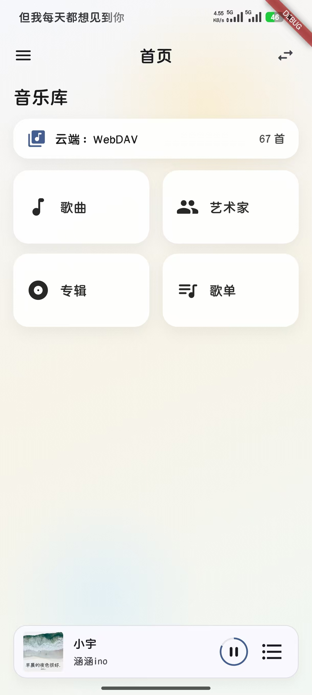
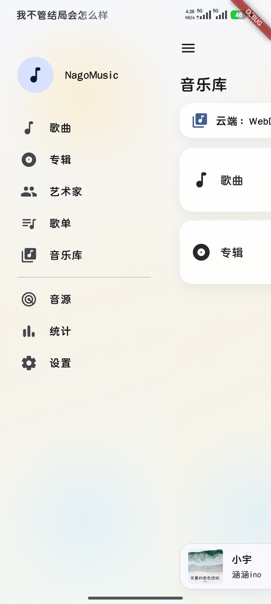
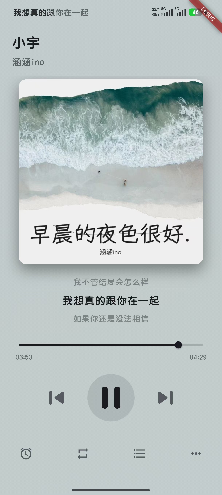
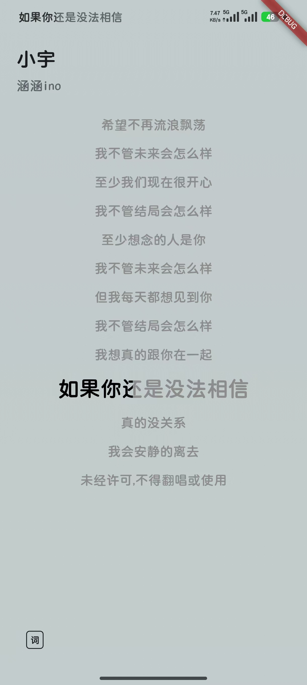

# NagoMusic

一款面向 WebDAV 与本地音乐的播放器，提供完整的音乐库管理、搜索、歌词、播放控制与主题外观设置。适合在多设备间同步音乐库，同时保留本地扫描与管理能力。

## 功能

- WebDAV 与本地音源管理，支持扫描与库内统计
- 音乐库浏览：歌曲 / 专辑 / 艺术家 / 歌单
- 搜索与歌词联动检索
- 播放器界面与歌词页切换
- 迷你播放器与底部控制栏
- 统计与缓存管理
- 状态栏歌词服务（魅族 / Lyricon 可选）
- 主题与外观设置（动态渐变、主题模式、平板模式）

## 支持歌词

- LRC（含翻译行解析）

## 界面预览

| 首页 | 侧边栏 |
| --- | --- |
|  |  |
| 播放器 | 歌词 |
|  |  |

## 适用平台

- Flutter（Android）

## 开发与运行

```bash
flutter pub get
flutter run
```
