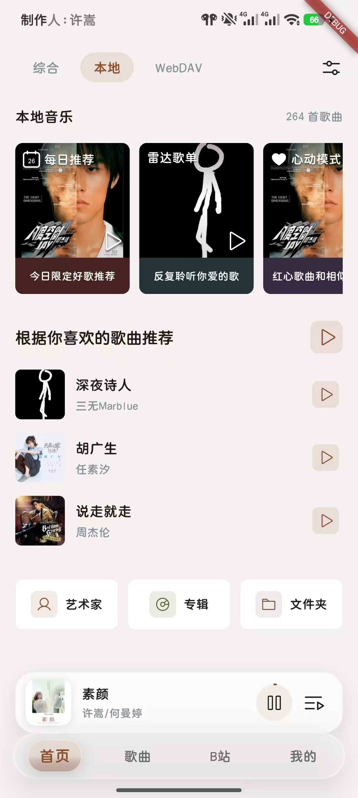
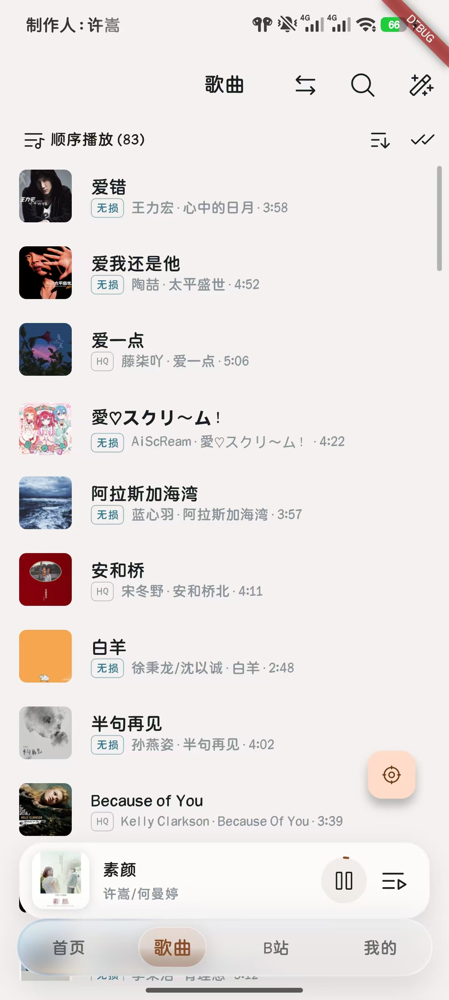
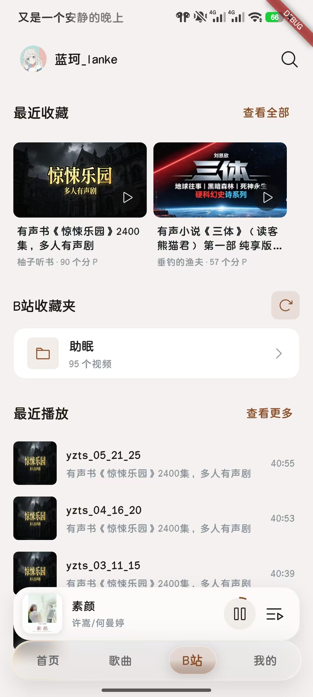
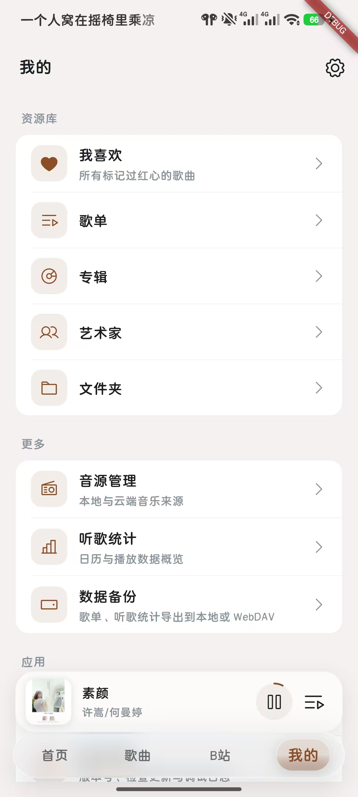
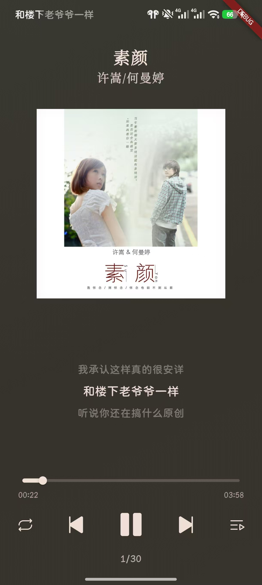

# NagoMusic

一款面向 WebDAV 与本地音乐的播放器，提供完整的音乐库管理、搜索、歌词、播放控制与主题外观设置。适合在多设备间同步音乐库，同时保留本地扫描与管理能力。

## 功能

- WebDAV 与本地音源管理，支持扫描与库内统计
- 音乐库浏览：歌曲 / 专辑 / 艺术家 / 歌单
- 搜索与歌词联动检索
- 播放器界面与歌词页切换
- 迷你播放器与底部控制栏
- 统计与缓存管理
- 状态栏歌词服务（魅族 / Lyricon 可选）
- 主题与外观设置（动态渐变、主题模式、~~平板模式~~，平板被我弟拿走了~自测吧）

## 支持歌词

- LRC（含翻译行解析）

## 界面预览

<table>
  <tr>
    <th>首页</th>
    <th>歌曲</th>
  </tr>
  <tr>
    <td></td>
    <td></td>
  </tr>
  <tr>
    <th>B站</th>
    <th>我的</th>
  </tr>
  <tr>
    <td></td>
    <td></td>
  </tr>
  <tr>
    <th colspan="2">播放器</th>
  </tr>
  <tr>
    <td colspan="2" align="center"></td>
  </tr>
</table>

## 适用平台

- Flutter（Android）

## 开发与运行

```bash
flutter pub get
flutter run
```

## 支持项目

如果 NagoMusic 对你有帮助，欢迎通过下面的方式支持项目持续开发：

- [爱发电](https://afdian.com/a/dittowind)

<p align="center">
  
</p>
